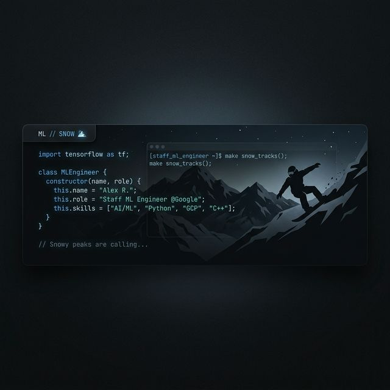

# 👋 Hi, I'm Lifan!

### Staff ML Engineer @ Google | Prolific Builder | Snowboarder 🏂

I build local-first tools and agentic frameworks to solve real-world problems. I'm currently focused on the future of **Agentic Engineering** and **Personal Finance Optimization**.

---

## 🚀 Featured Projects

### 🧠 [Context Harness](https://github.com/lifan-builds/context-harness)
*AI Agents lose context too fast.* I built a persistent filesystem-based context manager for autonomous AI agents. It ensures your coding agents remember decisions, plans, and discoveries across long-running sessions.

### 💳 [Credit Card Tracker](https://github.com/lifan-builds/credit-card-tracker)
A local-first, privacy-focused tool to optimize and track credit card points and welcome offers. No more spreadsheets—just clean, automated tracking of your path to the next free flight.

### ❄️ [Snow Deals](https://github.com/lifan-builds/deal)
Skiing is getting expensive. I built a bot/tracker to never miss a powder day deal or discount lift ticket again.

---

## 🛠️ Build in Public
I'm documenting my journey as I build and scale these tools. If you're into AI agents, local-first software, or just want to chat about the best lines at Tahoe, let's connect!

- **𝕏 (Twitter):** [@LifanBuilds](https://x.com/LifanBuilds)
- **GitHub:** [lifan-builds](https://github.com/lifan-builds)

---

