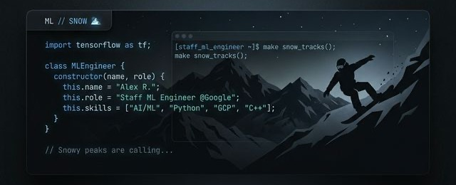

<p align="center">
  
</p>

<div align="center">

# Lifan

Staff ML Engineer @ Google building local-first AI tools, agent workflows, and practical consumer apps.


</div>

---

## `> whoami`

```python
lifan = {
    "role": "Staff ML Engineer @ Google",
    "builds": ["local-first AI", "agent control planes", "consumer utilities"],
    "style": "ship useful tools, then open-source the parts that help builders",
    "current_focus": "AI systems that stay useful under human control",
    "hub": "https://x.com/LifanBuilds",
}
```

---

## What I Build With

<div align="center">


</div>

## Featured Builds

| Project | Stars | Why it exists |
|---------|-------|---------------|
| [**Flying Pig AI**](https://github.com/lifan-builds/flyingpig) |  | AI customer-service advocate that runs in a supervised local dashboard, drives support chats, and pauses at decision checkpoints before consequential actions. |
| [**mychart-cli**](https://github.com/lifan-builds/mychart-cli) |  | Public local-first CLI for exporting patient-owned MyChart records through a Chrome/Puppeteer harness while keeping credentials and raw records local. |
| [**Perks Reminder**](https://github.com/lifan-builds/perks-reminder) |  | Free, open-source credit card benefits tracker for welcome bonuses, annual fees, recurring credits, certificates, and loyalty expirations. |
| [**FreshPowder**](https://github.com/lifan-builds/snow-deal) |  | Ski and snowboard deal aggregator tracking 12k+ current and historical deals across 28+ North American retailers every 6 hours. |
| [**CastForge**](https://github.com/lifan-builds/castforge) |  | Source-to-podcast automation framework extracted from Nitan Podcast, with reusable pipeline stages, audio integrations, publishing, and validation. |
| [**Nitan Podcast**](https://github.com/lifan-builds/nitan-podcast) |  | Weekly Chinese podcast generated from USCardForum discussions and shipped through RSS, Apple Podcasts, Spotify, and GitHub Pages. |
| [**Context Harness**](https://github.com/lifan-builds/context-harness) |  | Tiny filesystem memory layer for coding agents: `AGENTS.md`, `CONTEXT.md`, `NOW.md`, `PLAN.md`, and small local scripts. |
| [**Agent Nexus**](https://github.com/lifan-builds/agent-nexus) |  | One manifest for deploying skills, hooks, and MCP servers across Claude Code, Cursor, Google Antigravity, Codex, and related IDEs. |

---

## Current Themes

- Local-first AI that keeps user data and decisions close to the user.
- Agent control planes that make AI coding sessions more durable and inspectable.
- Consumer utilities that replace private spreadsheets with real products.
- Practical automation that keeps humans in the loop for consequential actions.

---

## Connect

<div align="center">

[](https://x.com/LifanBuilds)

</div>
